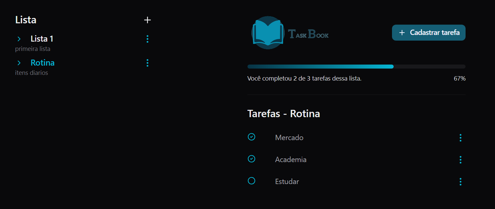

# Task Book APP

Aplicação em React usando tailwind, radix-ui e zod.

## Como funciona

Ele exibe o nome e descrição das listas de tarefas na esquerda.
Exibe os itens de tarefas na direita.
Exibe o estado de estado de conclusão de todas tarefas, com uma barra de progressão com a porcentagem.

### Funcionalidades

Cadastro, edição e exclusão de listas.
Cadastro, edição e exclusão de tarefas dentro de uma lista.
Marcar ou desmarcar uma tarefa como concluída.

## Visualizar

Link para visualização <a href="https://task-book-app-vercel.vercel.app" target="_blank"> Blog React </a>